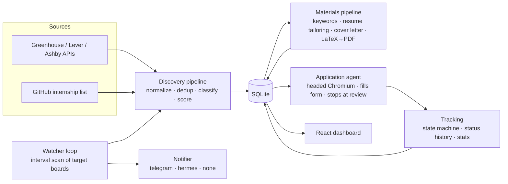

# EconPilot

EconPilot is a **local-first** system that discovers job/internship postings from
company ATS APIs, tailors a resume and cover letter for each with an LLM, and
tracks every application through a validated pipeline — all from a retro-terminal
dashboard. It adds a **human-supervised browser agent** that fills out
application forms for you and **stops at the review step so you always click
submit yourself**, plus a background **watcher** that pings you when new matching
roles appear. Everything runs on your machine; the only data that leaves it is
what you choose to send to your configured LLM provider.

<!-- Screenshot: add a capture of the /queue dashboard at docs/dashboard.png and
     it will render here. -->
> 📸 _Add `docs/dashboard.png` (a shot of the `/queue` view) to show the dashboard here._

---

## Quickstart (native)

Prerequisites: **Python ≥ 3.11**, **Node ≥ 18**, and [`uv`](https://docs.astral.sh/uv/)
(or plain `pip`). Optional: `tectonic` for PDF compilation, Chromium for the agent.

```bash
# 1. Clone
git clone https://github.com/A319K/job-pilot.git && cd job-pilot

# 2. First-run setup (copies configs, runs migrations, seeds example companies)
python scripts/setup.py

# 3. Install + start the backend  (http://localhost:8000)
cd backend
uv venv .venv && uv pip install -e ".[dev]" --python .venv/bin/python
.venv/bin/uvicorn app.main:app --reload

# 4. Install + start the frontend, in a second terminal  (http://localhost:5173)
cd frontend && npm install && npm run dev

# 5. Seed base resumes (compiles the 3 LaTeX templates; needs tectonic)
cd backend && .venv/bin/python scripts/seed_resumes.py

# 6. Open http://localhost:5173 and click SCAN on the queue.
```

That's the whole loop: **scan** to populate the queue, **queue** a job you like,
**prepare** to generate tailored materials, then track it through the pipeline —
and optionally **autofill** the employer's form.

If you skipped the LLM key in step 2, add it to `backend/.env` (`LLM_API_KEY=`)
before using Prepare or the agent. Scoring and discovery work without it.

---

## Docker (services only)

Two supported run modes:

1. **All host-native** — the quickstart above.
2. **Hybrid** — run the API + dashboard + watcher in Docker, run the agent from
   the host.

```bash
python scripts/setup.py          # creates backend/.env + profile.yaml
docker compose up --build        # dashboard at http://localhost:8080
docker compose exec backend python scripts/seed_companies.py   # seed once
```

Compose serves the **dashboard, API, and watcher/scheduler**. The nginx frontend
reverse-proxies `/api/*` to the backend, so it's a single origin with no CORS
setup. The sqlite DB and generated PDFs live on the `econpilot-data` volume; your
`profile.yaml` is mounted read-only.

> **The form-filling agent is intentionally not dockerized.** It drives a
> **headed** Chromium window on your desktop and keeps a persistent, logged-in
> browser profile between requests — neither fits in a container. Run it
> host-native (see [The application agent](#the-application-agent)) even if the
> rest of the stack is in Docker.

---

## Configuration reference

All settings are environment variables (via `backend/.env`). Names are
case-insensitive; defaults are what you get if unset.

| Variable | Default | Phase / area | Notes |
|---|---|---|---|
| `LLM_BASE_URL` | `https://openrouter.ai/api/v1` | LLM | Any OpenAI-compatible endpoint (incl. local). |
| `LLM_MODEL` | `z-ai/glm-5.2` | LLM | Model id passed to the endpoint. |
| `LLM_API_KEY` | _(empty)_ | LLM | Required for materials + agent answer generation. |
| `DATABASE_URL` | `sqlite:///./econpilot.db` | Core | SQLAlchemy URL. |
| `NOTIFIER` | `none` | Watcher | `none` \| `telegram` \| `hermes`. |
| `TELEGRAM_BOT_TOKEN` | _(none)_ | Watcher | Required when `NOTIFIER=telegram`. |
| `TELEGRAM_CHAT_ID` | _(none)_ | Watcher | Required when `NOTIFIER=telegram`. |
| `HERMES_SEND_TARGET` | `telegram` | Watcher | Target passed to `hermes send`. |
| `HERMES_BIN` | `hermes` | Watcher | Path/name of the hermes binary. |
| `WATCHER_ENABLED` | `false` | Watcher | Opt-in; starts the scheduler on boot. |
| `WATCH_INTERVAL_MINUTES` | `30` | Watcher | Minutes between watch cycles. |
| `WATCH_NOTIFY_MIN_SCORE` | `40` | Watcher | Min score for a new job to notify. |
| `WATCH_QUIET_HOURS` | _(none)_ | Watcher | e.g. `23-07`; queues notifications during the window. |
| `SEASONAL_PREACTIVATION_ENABLED` | `true` | Watcher | Monthly cron (1st): refresh corpus + target companies expected next month. Needs the watcher on. |
| `GITHUB_REPO_OWNER` | `SimplifyJobs` | Discovery | Internship-list repo owner. |
| `GITHUB_REPO_NAME` | `Summer2026-Internships` | Discovery | Changes seasonally. |
| `GITHUB_REPO_BRANCH` | `dev` | Discovery | Branch to read. |
| `GITHUB_REPO_LISTINGS_PATH` | `.github/scripts/listings.json` | Discovery | Structured feed (absolute dates, ATS urls). |
| `GITHUB_ADDITIONAL_FEEDS` | `["vanshb03/…"]` | Discovery | Extra feeds merged in for redundancy/startups; JSON list of `owner/name/branch/path`. Failing feeds are skipped. |
| `PREFERRED_JOB_FAMILIES` | `["swe","ml"]` | Scoring | JSON list; boosts scores. |
| `SCAN_CONCURRENCY` | `8` | Discovery | Concurrent per-company fetches. |
| `SCAN_MAX_AGE_DAYS` | `21` | Discovery | Drop jobs posted older than N days at scan time; `0` disables, undated kept. |
| `PREPARE_TAILOR_DEFAULT` | `false` | Materials | `false` = Prepare selects a pre-built base resume and reuses its PDF; `true` = rewrite a job-specific resume every time. |
| `LATEX_COMPILER` | `tectonic` | Materials | Compiler on `PATH` for PDFs. |
| `OUTPUT_DIR` | `output` | Materials | Where PDFs are written. |
| `JD_DESCRIPTION_MAX_CHARS` | `6000` | Materials | JD text truncation before LLM. |
| `AGENT_CONTEXT_DIR` | `browser_contexts/default` | Agent | Persistent Chromium profile (gitignored). |
| `AGENT_MAX_ACTIONS_PER_STEP` | `40` | Agent | Hard cap; pause on exceed. |
| `AGENT_MAX_PAGE_STEPS` | `15` | Agent | Hard cap. |
| `AGENT_MAX_LLM_CALLS` | `25` | Agent | Hard cap. |
| `AGENT_WALL_CLOCK_SECONDS` | `600` | Agent | 10-minute run ceiling. |

---

## The application agent

A **semi-autonomous, human-supervised** form filler. Given an application in
`queued`/`in_progress` with a prepared resume PDF, it opens the job's page in a
**headed, persistent** Chromium window, fills every field it safely can from
`profile.yaml`, attaches the resume/cover-letter PDFs, advances multi-step
flows, and **stops at the final review step** — moving the application to
`ready_to_submit` and leaving the browser open for you to review and submit.

**The agent never submits. Safety is enforced in code, not just prompts**
(`app/agent/safety.py`, `app/config.py`):

- **Physically cannot submit.** The browser click helper checks *every* click
  against a submit blocklist (`submit`, `submit application`, `send
  application`, `finish`, …) and raises rather than clicking. A hijacked or
  confused LLM is unable to submit.
- **Never handles credentials.** Login/signup walls, CAPTCHAs, and email
  verification pause the run immediately — it never creates accounts.
- **Never fabricates.** Unmapped required fields pause instead of guessing.
- **EEO answered only from your defaults.** `profile.eeo_defaults` verbatim, or
  the decline-to-answer option; otherwise it pauses.
- **Sensitive fields are off-limits.** Password, SSN, salary expectation, and
  payment fields are never filled.
- **Hard caps.** 40 actions/step, 15 page-steps, 25 LLM calls, 10-minute wall
  clock — any breach pauses with `cap_exceeded`.

A deterministic mapper (`app/agent/mapping.py`) resolves the bulk of a typical
Greenhouse form with **zero LLM calls**; only genuinely ambiguous fields reach
the model. An **answer bank** (Settings → Answer Bank) caches your approved
answers to recurring custom questions and reuses them with no LLM call; answers
the model generates are saved as *suggestions* you approve before they're ever
reused. Per-ATS adapters cover greenhouse/lever/ashby/workday with a generic
fallback.

### Running the agent

Install the optional `agent` extra (kept separate so the base install stays
browser-free), then drive it from the dashboard:

```bash
cd backend
uv pip install -e '.[agent]' --python .venv/bin/python
.venv/bin/python -m playwright install chromium
.venv/bin/uvicorn app.main:app          # single-process, no --reload
```

> **Run the API single-process.** Pause/resume keeps the live browser in memory
> between requests, so use one worker and no `--reload` during a real run — a
> reload drops the open browser. The persistent profile in
> `browser_contexts/default/` is reused across runs.

Open `/applications/:id`, click **AUTOFILL**, and watch the action log fill the
form and stop at review. If it pauses (login/CAPTCHA/odd field), fix it in the
open browser and click **resume**, then submit manually yourself.

**Workday note:** Workday usually gates applications behind an account login on
first use per company, so the **first Workday run for a company is expected to
pause with `login_required`** — log in once in the shared browser, then resume;
the session cookie is reused afterward.

---

## Notification adapters

The watcher pushes batched "new roles" alerts through a pluggable adapter set by
`NOTIFIER` (`app/notify/`). All make **zero LLM calls**.

- **`none`** (default) — no-op; logs at debug.
- **`telegram`** — native Bot API `sendMessage` over `httpx` (no extra deps).
  Needs `TELEGRAM_BOT_TOKEN` + `TELEGRAM_CHAT_ID`. Titles/companies are escaped
  for MarkdownV2; on rejection it retries once as plain text.
- **`hermes`** — shells out to `hermes send <target> -m <message>` via
  `create_subprocess_exec` (never a shell, so untrusted job text can't inject
  commands). Needs `HERMES_SEND_TARGET` (default `telegram`); binary is
  `HERMES_BIN`. A missing binary logs one error and disables notifications
  rather than crashing the watcher.

`POST /notify/test` sends a test message through the configured adapter and
returns `{success, adapter}` — the quickest way to verify setup (also a button
under Settings → Watcher). Notification failures are always logged and swallowed;
they can never fail a scan.

To get a Telegram bot: message [@BotFather](https://t.me/BotFather) for a token,
message your bot once, then read your numeric chat id from
`https://api.telegram.org/bot<token>/getUpdates`.

---

## Architecture



- **Backend** — FastAPI + SQLAlchemy 2.0 + Alembic + Pydantic v2. Sources are
  dumb fetchers; the pipeline owns normalization/dedup/classification/scoring.
- **Frontend** — Vite + React + TypeScript + Tailwind v4, server state in
  `@tanstack/react-query`. `frontend/src/api/types.ts` mirrors backend schemas.
- **Agent** — async Playwright behind an injectable interface, with the
  safety predicates and browser click-blocklist enforced in code.

Want to add a source? See [docs/adding-a-source.md](docs/adding-a-source.md).

---

## How it works (per area)

- **Discovery** — `POST /scan` fetches every company with a known `ats_type`
  plus one or more community internship feeds (`listings.json` from SimplifyJobs
  and any `GITHUB_ADDITIONAL_FEEDS`, merged with a failing feed skipped), dedups
  by normalized company/title/location, classifies `role_type`/`job_family`, scores
  deterministically against `profile.yaml`, and upserts `Job` rows. As listings
  are ingested, each company's ATS + board id is resolved from its application
  URL, so a one-off listing becomes a directly re-scannable source next cycle —
  the corpus self-expands from ~10 seeds into hundreds of companies. Browse via
  `GET /jobs?...`.
- **Seasonal pre-activation (Phase B)** — internships are strongly seasonal, so
  each company's historical posting months are derived from the dated feed and
  stored on `Company.expected_months`. On the 1st of each month a cron refreshes
  the corpus and flips companies expected to post *next* month into active watch
  targets (old targets are kept, never dropped), so the watcher is already
  polling a board the moment a role opens. Off unless the watcher is enabled.
- **Materials** — `POST /jobs/{id}/prepare` gets-or-creates the `Application`,
  extracts JD keywords, selects/tailors a base resume, drafts a cover letter,
  and compiles both to PDF. Base templates mark rewritable spans with
  `%% TAILOR-BEGIN:<name>` / `%% TAILOR-END:<name>`; the LLM can only touch text
  between a matching pair.
- **Tracking** — a validated state machine
  (`discovered → queued → in_progress → ready_to_submit → submitted → {oa,
  interview, offer, rejected, withdrawn}`), full status history, notes, filters,
  and a `/stats` funnel scoped by internship/full-time.
- **Dashboard** — `/queue`, `/pipeline` (kanban), `/applications/:id`, `/stats`,
  `/settings`. Keyboard-driven (`j`/`k`/`Enter`/`q`/`/`/`?`).
- **Watcher** — an opt-in `AsyncIOScheduler` that re-scans target boards on an
  interval, flags genuinely new postings, deactivates vanished ATS jobs, and
  sends one batched notification per cycle. Quiet-hours queue to a table and
  flush later; `GET /watcher/status` and `POST /watcher/run-now` expose it.

---

## FAQ

**Do I need `tectonic`?** Only to compile resume/cover-letter PDFs (`Prepare`,
`seed_resumes.py`). Install with `brew install tectonic` or see the
[tectonic docs](https://tectonic-typesetting.github.io/). Everything else —
scanning, scoring, tracking — works without it.

**How do I install the agent / Playwright?** `uv pip install -e '.[agent]'` then
`python -m playwright install chromium`. The agent is optional; the base install
and most tests are browser-free.

**How do I find a company's ATS board id?** Visit its careers page and see where
it redirects: Greenhouse → `boards.greenhouse.io/<id>` or
`job-boards.greenhouse.io/<id>`; Lever → `jobs.lever.co/<id>`; Ashby →
`jobs.ashbyhq.com/<id>`. That last slug is the board id. Board ids change if a
company migrates ATS providers — verify against the live page.

**What should I expect from Workday?** Applications are usually behind an account
login, so the first run per company pauses with `login_required`. Log in once in
the shared browser and resume; the session is reused afterward.

**The queue is empty.** Seed companies (`scripts/seed_companies.py` or Settings →
Target Companies), then click **SCAN**. Seed resumes (`scripts/seed_resumes.py`)
before using **Prepare**.

**Can I keep everything on-device?** Yes — point `LLM_BASE_URL` at a local
OpenAI-compatible server. Nothing in EconPilot assumes a specific provider. See
[SECURITY.md](SECURITY.md) for the full data-flow model.

---

## Development

```bash
# backend — no browser, no LLM, no LaTeX needed
cd backend && .venv/bin/python -m pytest

# frontend
cd frontend && npm run test && npm run build
```

Marker-gated groups (`-m latex`, `-m agent`) are skipped unless their tooling is
present; CI skips them too. Enable secret-scanning pre-commit hooks and read the
source-adding guide in [CONTRIBUTING.md](CONTRIBUTING.md). Security & privacy
model: [SECURITY.md](SECURITY.md).

---

## Roadmap

| Phase | What |
|---|---|
| 0 | Foundation — models, config, LLM client, minimal API. |
| 1 | Discovery — ATS clients, GitHub parsing, dedup/normalization, scoring, scan. |
| 2 | Materials — JD keywords, resume selection/tailoring, cover letters, LaTeX PDFs. |
| 3 | Tracking — validated state machine, history, notes, stats. |
| 4 | Dashboard — retro-terminal React UI. |
| 5 | Application agent — human-supervised Playwright filler that stops at review. |
| 6 | Watcher + notifications — scheduled polling, new/vanished detection, adapters. |
| 7 | Shareability — setup script, Docker, CI, docs, secret scanning. |

Licensed under the [MIT License](LICENSE).
